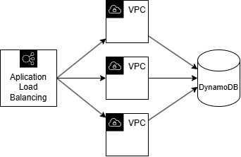
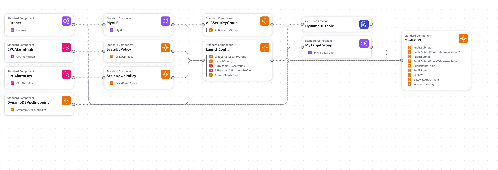

# Projeto AWS CloudFormation

### Luca Mizrahi

## Introdução ao Projeto

### Descrição do Projeto

O projeto AWS CloudFormation tem como objetivo criar uma arquitetura escalável e robusta na AWS para hospedar uma aplicação web. Utilizando o AWS CloudFormation, facilitamos a gestão de recursos e a automação de infraestrutura, permitindo implantações consistentes e repetíveis. A aplicação é distribuída automaticamente entre múltiplas instâncias EC2 através de um Application Load Balancer (ALB), garantindo alta disponibilidade e balanceamento de carga eficiente.

### Topologia da Aplicação

A aplicação é composta por uma instância EC2 que executa um servidor web Flask, conectado a um banco de dados MySQL. O Application Load Balancer (ALB) distribui o tráfego entre as instâncias EC2, garantindo alta disponibilidade e escalabilidade. O Auto Scaling Group monitora a utilização dos recursos e ajusta automaticamente o número de instâncias EC2 conforme necessário. O CloudWatch monitora o desempenho da aplicação e envia alertas caso o uso recursos ultrapasse os limites definidos ou seja menor que o esperado, o que faz com que o Auto Scaling Group ajuste o número de instâncias EC2, para garantir uma maior eficiência e economia de custos.



### Diagrama da Arquitetura AWS

O diagrama da arquitetura AWS mostra a relação entre os diferentes serviços utilizados na aplicação, incluindo EC2, ALB, Auto Scaling Group e CloudWatch.



### Calculo dos Custos do Projeto
Para estimar os custos associados à arquitetura proposta, utilizamos a AWS Cost Calculator. Esta ferramenta permite modelar e comparar os custos de diferentes configurações de serviços AWS, ajudando a tomar decisões informadas sobre escalabilidade e custo-benefício.

[Estimativa de Custos AWS](https://github.com/LucaMizrahi/Projeto_Cloud_AWS/blob/main/custos_AWS/My%20Estimate%20-%20Calculadora%20de%20Pre%C3%A7os%20da%20AWS.pdf)

## Comandos para utilização da aplicação

### Criação da Stack 

Comandos para criação da stack: 

```bash
chmod +x create_and_upload.sh
./create_and_upload.sh
```
Com esses 2 comandos é possível deixar o script executável, e executar o script que faz upload da aplicação para o bucket da AWS e cria a stack. 

Após alguns minutos a stack estará criada e será possível acessar a aplicação através do link que será gerado no output da stack.

Comando para obter o link da aplicação (DNS do Load Balancer): 

```bash
aws cloudformation describe-stacks --stack-name application-stack \
  --query 'Stacks[0].Outputs[?OutputKey==`LoadBalancerDNSName`].OutputValue' \
  --output text
```
**AVISO**: Armazene o link gerado com o comando acima, pois ele será utilizado para testar a aplicação.

### Teste da Aplicação

Agora que a aplicação está rodando, será utilizado o link gerado no comando anterior para testar a aplicação.

1. Acesse a rota principal da aplicação utilizando *curl*
    
    ```bash 
    curl http://<LoadBalancerDNS> # Rota Principal
    ```
    **AVISO**: Substitua `<LoadBalancerDNS>` pelo link gerado no comando de obtenção do link do DNS.

2. Acesse a rota `/users` da aplicação utilizando *curl*

    ```bash
    curl http://<LoadBalancerDNS>/users # Lista todos os usuários
    ```
    **AVISO**: Substitua `<LoadBalancerDNS>` pelo link gerado no comando de obtenção do link do DNS.
  
3. Crie um usuário no banco de dados

    ```bash
    curl -X POST http://<LoadBalancerDNS>/users \
    -H "Content-Type: application/json" \
    -d '{"id": "1", "name": "Luca"}' # Criar um Novo Usuário
    ```
    **AVISO**: Substitua `<LoadBalancerDNS>` pelo link gerado no comando de obtenção do link do DNS.

4. Acesse a rota `/users` da aplicação utilizando *curl*

    ```bash
    curl http://<LoadBalancerDNS>/users # Lista todos os usuários
    ```
    OU 

    ```bash
    curl http://<LoadBalancerDNS>/users/1 # Lista um usuário específico pelo ID
    ```

    **AVISO**: Substitua `<LoadBalancerDNS>` pelo link gerado no comando de obtenção do link do DNS.
  
5. Delete um usuário do banco de dados

    ```bash
    curl -X DELETE http://<LoadBalancerDNS>/users/1 # Deletar um Usuário pelo ID
    ```
    **AVISO**: Substitua `<LoadBalancerDNS>` pelo link gerado no comando de obtenção do link do DNS.

### Update da Stack

Para atualizar a stack, é necessário alterar o arquivo `template.yaml` e executar o script `update_stack.sh`.

1. Altere o arquivo `template.yaml` conforme necessário.

2. Execute o script `update_stack.sh` para atualizar a stack.

    ```bash
    chmod +x update_stack.sh
    ./update_stack.sh
    ```
    **AVISO**: O script irá atualizar a stack com as alterações feitas no arquivo `template.yaml`.

### Delete da Stack

1. Execute o script `delete_stack.sh` para deletar a esvaziar o bucket, deletar o bucket e também deletar a stack.

    ```bash
    chmod +x update_stack.sh
    ./update_stack.sh
    ```
    **AVISO**: O script irá deletar a stack e não será mais possível utilizar a aplicação.

### Teste do Elastic Auto Scaling com o Locust

Para testar o Elastic Auto Scaling, é necessário primeiro baixar para o locust, que é uma ferramenta de teste de carga, utilizando requests HTTP.

Instale o `locust` pelo pip:

```bash
pip install locust
```

#### Utilização do Locust pela interface WEB

1. Execute o comando `locust` para iniciar o servidor web do locust.

    ```bash
    locust -f locustfile.py --host=http://<LoadBalancerDNS>
    ```
    **AVISO**: Substitua `<LoadBalancerDNS>` pelo link gerado no comando de obtenção do link do DNS.
  
2. Acesse a interface web do locust através do link `http://localhost:8089`.

3. Defina o número de usuários e a taxa de usuários por segundo.

    **Sugestão**: Utilize *100* usuários e *10* usuários por segundo.

4. Inicie o teste de carga e observe o comportamento do Auto Scaling Group e do CloudWatch, para confirmar que o Auto Scaling está funcionando corretamente.

#### Utilização do Locust pela linha de comando

1. Execute o comando `locust` para iniciar o teste de carga.

    ```bash
    locustfile.py --host=http://<LoadBalancerDNS> --headless -u 100 -r 10 -t 15m
    ```
    - `-u` ou `--users`: Número de usuários
    - `-r` ou `--spawn-rate`: Taxa de usuários por segundo
    - `-t` ou `--run-time`: Tempo de execução do teste 
    
    **AVISO**: Substitua `<LoadBalancerDNS>` pelo link gerado no comando de obtenção do link do DNS.

2. Observe o comportamento do Auto Scaling Group e do CloudWatch, para confirmar que o Auto Scaling está funcionando corretamente.


